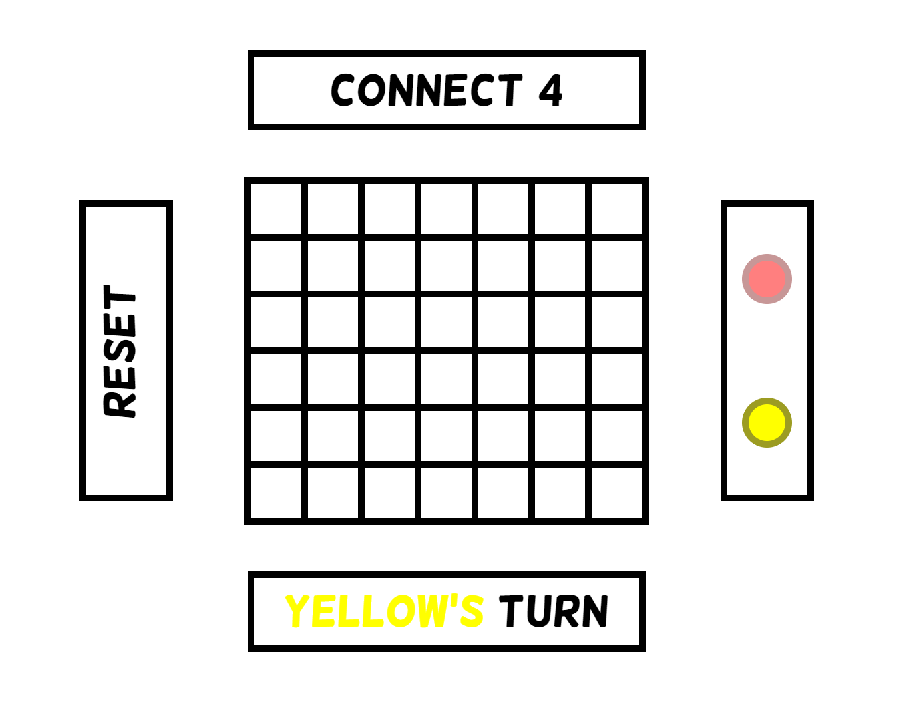
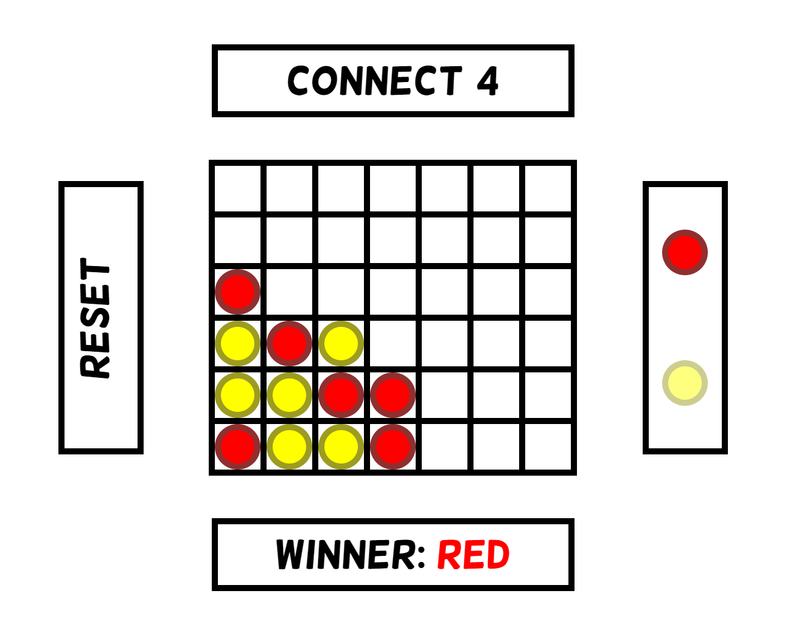

# Connect4
This Connect 4 game will allow you and a friend to play Connect 4 on a singular device

## Running
Note: nodejs is required to run this project; however, the game is bundled into `public/game.html`, so you can open that with your browser

1. Clone this repository
    - `git clone https://github.com/astalivia/Connect4.git`
2. Navigate to the project folder
    - `cd Connect4`
3. Run the http server
    - `node server.js`
4. Hold CTRL key and click the link that shows up after running the command

## How to Play
Each player will take turns placing chips in the board. Connect 4 pieces of your same color horizontally, vertically, or diagonally to win!

To reset the game, hit the RESET button on the side of the screen.

## Gameplay

Start state:

Win state:
